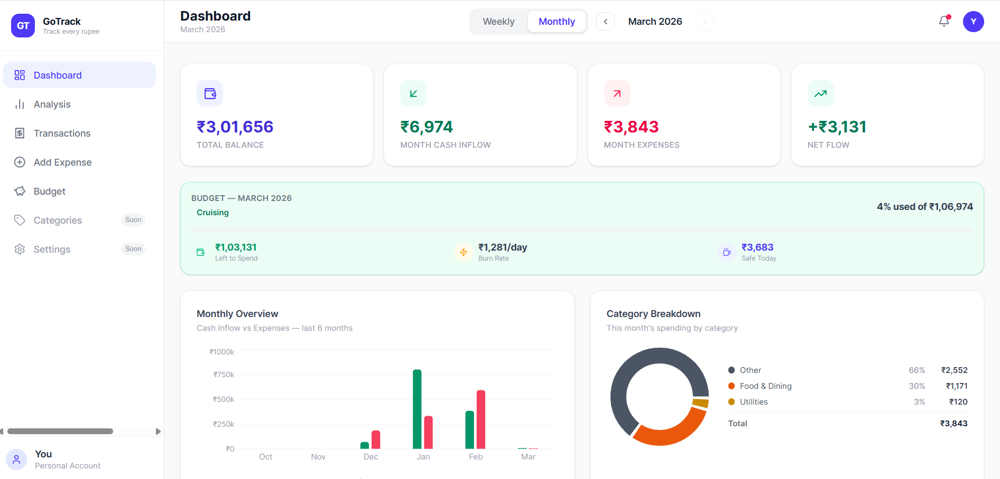
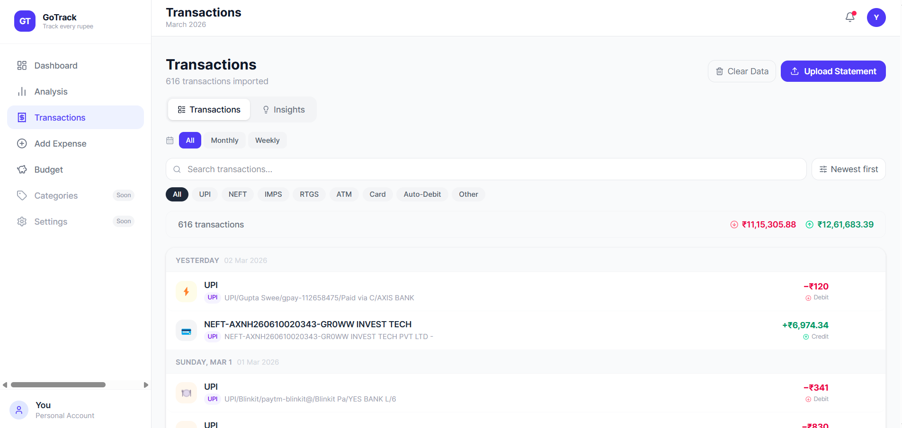
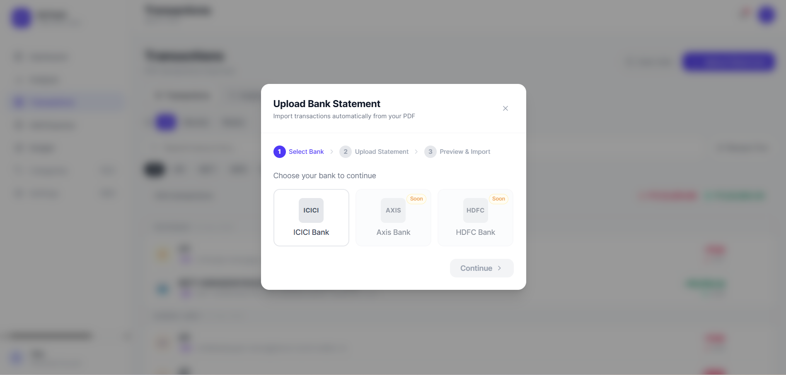
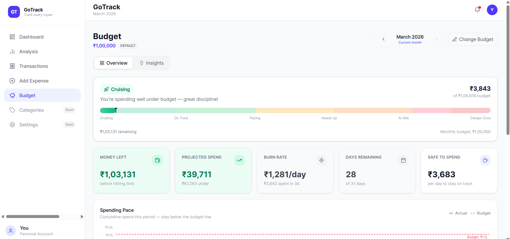
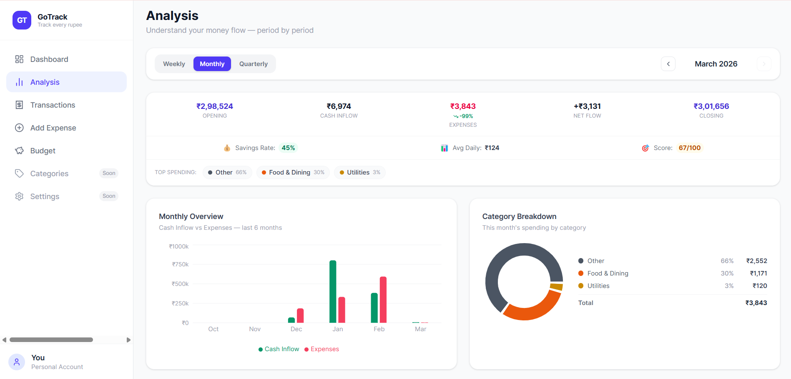

# GT — GoTrack

> **Your money, fully understood.** GoTrack is a privacy-first personal finance tracker that turns raw bank statements into clear, actionable insights — entirely in your browser, with zero data sent to any server.

<div align="center">



</div>

---

## What is GoTrack?

GoTrack is a **personal expense tracking web app** built for people who want complete visibility into their finances without handing their data to a third-party service. You drop in a bank statement PDF, GoTrack parses every transaction locally in your browser, auto-categorises them, and gives you a rich dashboard of spending trends, budget health, payment patterns, and smart insights.

No sign-up. No server uploads. No subscription. Your PDF never leaves your device.

---

## Features at a Glance

| Feature | Description |
|---------|-------------|
| **PDF Statement Upload** | Drag-and-drop ICICI bank statements — parsed 100% client-side |
| **Auto-categorisation** | 40+ keyword rules map transactions to Food, Transport, Shopping, Health, etc. |
| **Dashboard** | Period-filtered stats, budget quick-check, spending chart, category breakdown |
| **Transactions** | Full transaction list with search, sort, payment-type filter, and period navigation |
| **Budget Tracker** | Per-month spending limits, burn rate, safe-daily-spend, pace chart, history |
| **Analysis** | Cash inflow sources, payment method breakdown, day-of-week spending patterns |
| **Period Navigation** | Switch between Weekly / Monthly views and navigate to any past period |
| **Budget Opt-out** | Mark any transaction as excluded from budget calculations |

---

## Screenshots

### Dashboard

*Period-filtered balance stats, budget quick-stats widget, spending trend chart, and category donut.*

### Transactions

*Full transaction list with search, sort, payment-type pills, period filter, and an Insights tab.*

### Upload Statement

*Three-step upload modal: select bank → drop PDF → preview & import.*

### Budget

*Per-month budget tracking with spending pace chart, stat cards, and grouped monthly history bars.*

### Analysis

*Cash inflow sources, payment method split, and spending-by-day-of-week breakdown.*

---

## How to Use GoTrack

### Step 1 — Import your bank statement

1. Go to the **Transactions** tab in the sidebar
2. Click **Upload Statement**
3. Select your bank (**ICICI** is fully supported)
4. Drag & drop your `OpTransactionHistory` PDF, or click to browse
5. Click **Parse Statement** — GoTrack extracts every transaction locally
6. Review the preview, then click **Import All**

> Your PDF is read by the browser's built-in PDF engine (`pdfjs-dist`). It never touches a network request.

### Step 2 — Explore your Dashboard

Switch to the **Dashboard** tab. You'll immediately see:

- **Balance** — total money available across the imported statement period
- **Cash Inflows** — total deposits / salary credits for the selected period
- **Expenses** — total debits for the selected period
- **Net Flow** — inflows minus expenses (positive = saving, negative = overspending)

Use the **Weekly / Monthly** toggle and the **‹ ›** arrows in the navbar to navigate between time periods.

### Step 3 — Set a Budget

Go to the **Budget** tab and enter your monthly spending limit. GoTrack automatically:

- Adds any cash inflows (salary, transfers) to your **Spending Power**
- Tracks how much you've spent against that power
- Projects your end-of-month spend at your current burn rate
- Tells you exactly how much is safe to spend today

You can set a **different budget for each month** — for example ₹50,000 for a lean month and ₹1,00,000 for a holiday month. Each month's budget is shown as its own bar in the history chart.

### Step 4 — Analyse your spending

The **Analysis** tab breaks down your money by:

- Where your income is coming from (salary vs transfers vs other credits)
- Which payment methods you use (UPI, credit card, NEFT, ATM, etc.)
- Which days of the week you spend the most

---

## How the Calculations Work

### Balance & Net Flow

```
Balance     = Sum of all Deposits − Sum of all Withdrawals  (lifetime)
Cash Inflow = Sum of all deposits in the selected period
Expenses    = Sum of all withdrawals in the selected period
Net Flow    = Cash Inflow − Expenses
```

### Budget: Spending Power

GoTrack uses a **spending power model** rather than a raw budget cap. The idea is that money you receive during the month should count toward what you can spend:

```
Spending Power = Monthly Budget Limit + Cash Inflows (this month)
```

For example: if your budget is ₹50,000 and you receive a ₹80,000 salary this month, your spending power is ₹1,30,000. This prevents the app from incorrectly flagging salary credits as "over budget."

Transactions marked **Budget Excluded** (e.g. a rent transfer that is not really discretionary spending) are invisible to all budget calculations.

### Budget Status Zones

| Zone | Condition | Meaning |
|------|-----------|---------|
| 🟢 **On Track** | Spent < 50% of spending power, time < 50% elapsed | Comfortably ahead |
| 🔵 **Pacing Well** | Spending rate proportional to time elapsed | Right on schedule |
| 🟡 **Watch Out** | 75–90% of spending power used | Getting close |
| 🟠 **Tight** | 90–100% used | Almost at limit |
| 🔴 **Over Budget** | > 100% of spending power spent | Limit exceeded |
| 🚨 **Significantly Over** | > 125% spent | Well over limit |

### Burn Rate & Safe-to-Spend

```
Burn Rate           = Total Spent ÷ Days Elapsed      (₹/day average)
Safe to Spend Today = Remaining Budget ÷ Days Remaining in Month
```

`Safe to Spend Today` answers the practical question: *"If I spread what's left evenly across the rest of the month, how much can I spend each day?"*

### Projected End-of-Month Spend

```
Projected Spend     = Burn Rate × Total Days in Month
Projected Remaining = Spending Power − Projected Spend
```

This is a straight-line projection — your current average daily spend extrapolated to month end. Useful as an early warning signal well before you actually hit the limit.

### Budget Used %

```
Budget Used % = (Total Spent ÷ Spending Power) × 100
```

Capped at 100% in the progress bar display, but the numeric figure is always shown accurately (e.g. 137% if you have gone over).

### Per-Month Budgets

Every month in the history can have its own spending limit. The system resolves the effective budget for each month using:

```
Effective Budget = monthlyBudgets[YYYY-MM] ?? defaultBudget
```

If you set ₹50k for March and ₹1L for February, the history chart shows each month's own bar — so you can compare spending against the limit that was actually relevant for that month.

### Category Detection

GoTrack analyses the transaction description (`Transaction Remarks` field) against a priority-ordered keyword ruleset:

```
"SWIGGY"          → Food & Dining
"UBER" / "OLA"    → Transport
"AMAZON"          → Shopping
"APOLLO"          → Health & Medical
"NETFLIX"         → Entertainment
... 40+ rules
```

Unmatched transactions fall into **Other**. Categories are colour-coded consistently across the dashboard, transaction list, and analysis charts.

### Payment Type Detection

Each transaction's description is scanned for payment method signals:

| Payment Type | Detection Keywords |
|--------------|--------------------|
| UPI | `UPI`, `@okaxis`, `PAY-` |
| Credit Card | `CC`, `CREDIT CARD`, `CCARD` |
| NEFT / IMPS | `NEFT`, `IMPS`, `RTGS` |
| ATM Withdrawal | `ATW`, `CASH WDL` |
| Auto-debit / ECS | `ECS`, `NACH`, `SI-` |
| Bank Charges | `CHARGES`, `FEE`, `PENALTY` |

This powers the **payment method filter** on the Transactions page and the **Payment Methods breakdown** on the Analysis page.

---

## Tech Stack

| Layer | Choice | Why |
|-------|--------|-----|
| Framework | React 18 + Vite | Fast HMR, minimal config |
| Styling | Tailwind CSS v4 | Utility-first, zero CSS files |
| Charts | Recharts | Composable, declarative React charts |
| Routing | React Router v6 | Standard SPA routing |
| Icons | lucide-react | Consistent, lightweight icon set |
| Date handling | date-fns | Tree-shakeable date utilities |
| PDF parsing | pdfjs-dist v3.11.174 | Client-side PDF text extraction |
| State | React Context + useReducer | No external state library needed |
| Storage | localStorage | Persists budget settings across sessions |

---

## Getting Started

```bash
# Clone the repo
git clone https://github.com/your-username/projectGT.git
cd projectGT/gt-gotrack

# Install dependencies
npm install

# Start the dev server
npm run dev
```

Open [http://localhost:5173](http://localhost:5173) in your browser.

```bash
# Production build
npm run build
```

---

## Supported Banks

| Bank | Statement Type | Status |
|------|---------------|--------|
| ICICI Bank | `OpTransactionHistory` PDF | ✅ Active |
| HDFC Bank | — | 🔜 Planned |
| Axis Bank | — | 🔜 Planned |
| SBI | — | 🔜 Planned |

---

## Privacy & Security

- **PDFs never leave your device.** Parsing happens entirely in the browser using `pdfjs-dist`. No file is uploaded anywhere.
- **Only structured data is stored.** After parsing, GoTrack works only with the extracted transaction rows (date, amount, description). The original PDF is discarded from memory.
- **Budget settings use localStorage.** Your configured monthly limits persist locally across browser sessions. No account, no cloud sync.
- **No analytics, no trackers.** GoTrack has zero external network requests during normal use.

---

## Project Structure

```
gt-gotrack/
  src/
    components/
      budget/           # BudgetSetupCard, BudgetStatusBar, BudgetStatCard,
      |                   SpendingPaceChart, BudgetInsights
      common/           # FileDropZone, BankUploadModal, Button, Badge
      dashboard/        # StatsRow, SpendingChart, CategoryBreakdown
      expenses/         # ExpenseList, ExpenseRow, PeriodSummaryCard
      layout/           # Sidebar, Navbar, PageWrapper
    context/
      ExpenseContext.jsx    # All transaction state (in-memory + import)
      BudgetContext.jsx     # Per-month budget settings (localStorage)
    hooks/
      useBudget.js          # Budget metrics derived from expenses + settings
      usePeriodAnalytics.js # Period navigation + filtered summaries
    pages/
      HomePage.jsx          # Dashboard
      ExpensesPage.jsx      # Transaction list + insights
      BudgetPage.jsx        # Budget tracker + history
      AnalysisPage.jsx      # Spending analysis
    utils/
      bankParsers/
        iciciParser.js      # ICICI OpTransactionHistory column parser
        index.js            # parseStatement() dispatcher
      budgetEngine.js       # All budget math (metrics, timeline, insights)
      paymentTypeDetector.js # Payment method classification
      categoryDetector.js   # Transaction category keyword matching
      pdfParser.js          # pdfjs-dist text extraction + row grouping
      salaryDetector.js     # Credit event detection
    constants/              # ROUTES, CATEGORIES, APP_CONFIG, NAV_LINKS
```

---

## Roadmap

| Phase | Description | Status |
|-------|-------------|--------|
| v1.0 | Core UI — dashboard, transactions, layout | ✅ Done |
| v1.5 | ICICI PDF parser, auto-categorisation, import modal | ✅ Done |
| v1.6 | Period analytics, balance intelligence, net flow | ✅ Done |
| v1.7 | Budget tab — spending power model, pace chart, insights | ✅ Done |
| v1.8 | Per-month budgets, Analysis page, Transactions search & filters | ✅ Done |
| v2.0 | Supabase auth + cloud persistence, multi-device sync | 🔜 Planned |
| v2.1 | HDFC / Axis / SBI parsers | 🔜 Planned |
| v2.2 | CSV & JSON data export | 🔜 Planned |

---

## Notes

- Bank statement PDFs are gitignored — never committed. Place samples in `samples/icici/` for local testing.
- `pdfjs-dist` is pinned to **v3.11.174**. v5 breaks on ICICI colour profiles (`toHex` error).
- Requires Node.js 18+ for any build/test scripts.

---

<div align="center">
  <sub>Built with ❤️ — Track every rupee.</sub>
</div>
